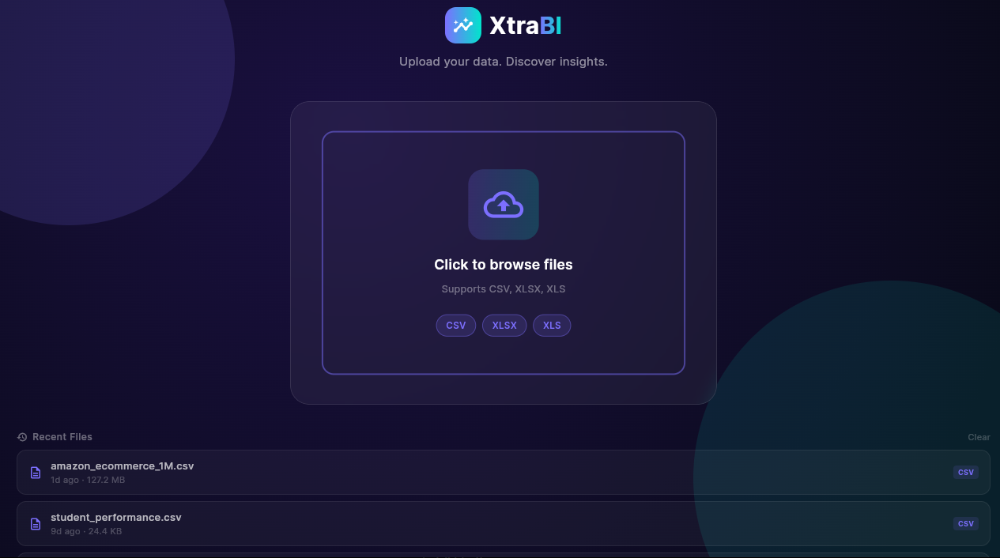
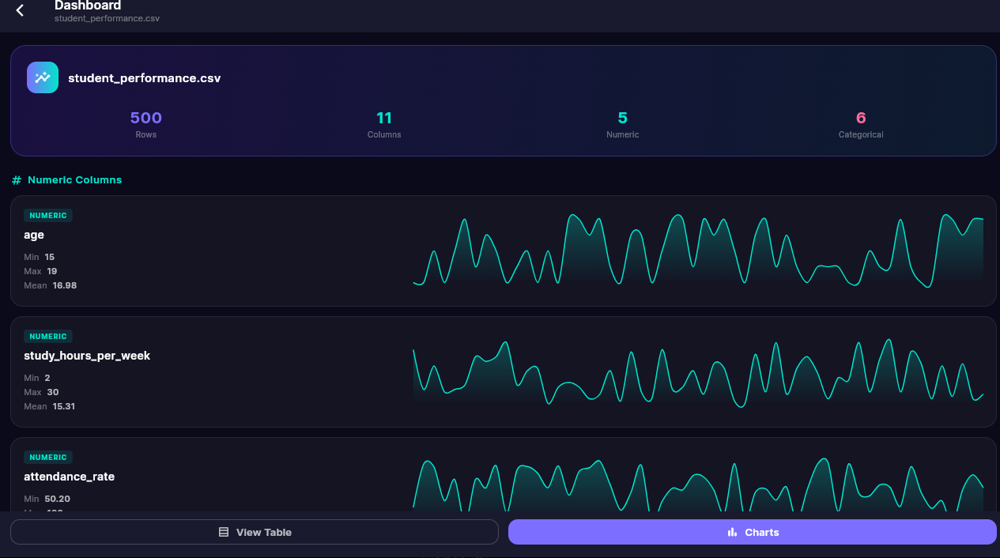
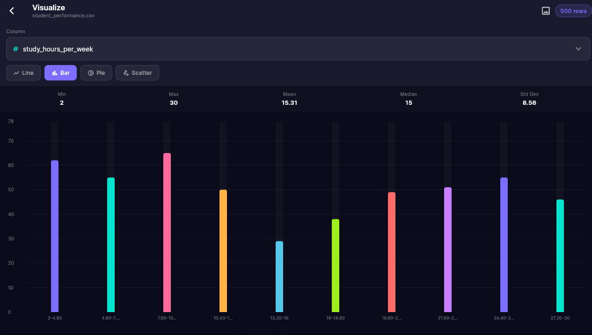
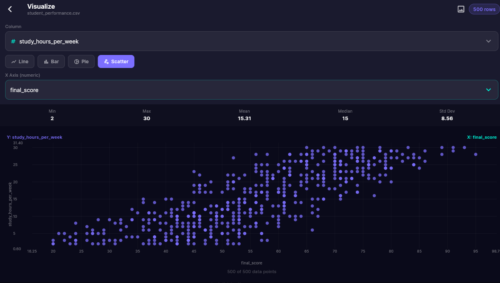

# XtraBI — Data Analysis & Visualization Platform

> **Upload your data. Discover insights.**

XtraBI is a powerful, cross-platform desktop and mobile application built with Flutter that lets you instantly analyze, visualize, and explore CSV and Excel datasets — no server, no cloud, no setup required.

---

## ✨ Screenshots

| Home Screen | Dashboard |
|:-----------:|:---------:|
|  |  |

| Bar Chart | Scatter Plot |
|:---------:|:------------:|
|  |  |

---

## 🚀 What is XtraBI?

XtraBI is a local-first data intelligence tool. Drop in a CSV or Excel file and instantly get:

- **Statistical summaries** — min, max, mean, median, and standard deviation per column
- **Interactive charts** — Line, Bar, Pie, and Scatter plots with beautiful dark-mode visuals
- **Smart dashboard** — auto-detected numeric and categorical columns with mini sparklines
- **Full data table** — scrollable, paginated preview of raw data
- **Chart export** — save any visualization as an image
- **Recent files** — quick access to previously analyzed datasets

---

## 📦 Supported File Formats

| Format | Extension |
|--------|-----------|
| Comma-Separated Values | `.csv` |
| Excel Workbook | `.xlsx` |
| Legacy Excel | `.xls` |

---

## 🖥️ Platform Availability

| Platform | Status |
|----------|--------|
| 🪟 **Windows** | ✅ Available |
| 🐧 **Linux** | ✅ Available (`.deb`, `.rpm`, `.tar.gz`) |
| 🤖 **Android** | ✅ Available |
| 🍎 **macOS** | 🔜 Coming Soon |
| 📱 **iOS** | 🔜 Coming Soon |
| 🌐 **Web** | 🔜 Coming Soon |

---

## 🔧 Features

- 📊 **Multiple chart types** — Bar, Line, Pie, and Scatter with axis controls
- 📈 **Column statistics** — Instant min/max/mean/median/std dev per numeric column
- 🗂️ **Auto column detection** — Distinguishes numeric vs. categorical columns automatically
- 📁 **Recent files** — Persistent history of loaded datasets with file size display
- 💾 **Export charts** — Save visualizations as images
- 🎨 **Dark mode UI** — Premium dark interface with vibrant accent colors
- ⚡ **High performance** — Handles large datasets (tested with 1M+ row files)
- 🔒 **Local first** — All processing happens on your device, no data leaves your machine

---

## 📥 Download

XtraBI is **closed source but free to use**. The source code is not publicly available.

👉 **Head to the [Releases](../../releases) page to download the latest version for your platform.**

Pre-built packages are available for:
- 🪟 **Windows** — `.exe` installer
- 🐧 **Linux** — `.deb`, `.rpm`.
- 🤖 **Android** — `.apk`

---

## 📄 License

XtraBI is **free to use** but the source code remains proprietary and closed source. Redistribution, modification, or reverse engineering of the software is not permitted.

---

## 💬 Support

For bug reports, feature requests, or general questions, please open an issue in the [Issues](../../issues) tab.

You can also reach us directly at: **[skasrafkamal@outlook.com](mailto:skasrafkamal@outlook.com)**
